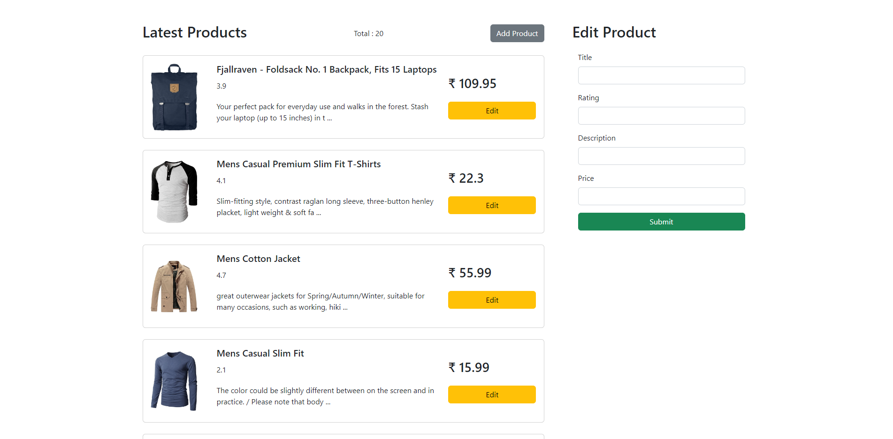

Open your terminal and type these:

1. `git clone https://github.com/tuntunpandit/tvs-assignment.git`
2. `npm install`
3. `ng serve -o`

## Live Demo : <a href="https://react-crud-tuntunpandit.vercel.app/">Click Here!</a>

# Screeshots

1. **Main Page**

  

